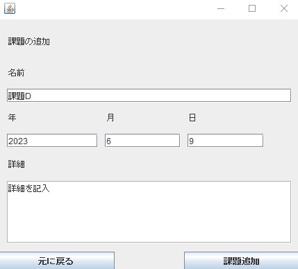

# 課題管理アプリケーション

## 概要

このアプリケーションは学校の宿題を一元管理するために開発されたアプリケーションです。

特に大学生が大学の宿題を管理するために作成されており、**毎週定期的に出される課題(毎週課題)を自動で追加する機能が備わっています。**

## 目的
このアプリケーションは私が大学で勉強をする中で、課題が学校のWebサイトやTeams、さらには授業資料に次の授業までにやっておくべきことが書かれているパターンなど様々な方法で出現するため、
これを一括で管理したいと思い開発したものです。

そのためこのアプリケーションの目的は **大学の課題を一括で管理すること** です。

## 使用画面の様子

## 使い方

### アプリを開く方法
productフォルダにある「TaskManagement3.exe」をダウンロード、ダウンロードした「TaskManagement3.exe」を開くことで使用可能です。

### 基本的な操作方法

#### 課題の追加
- 1.「課題の追加」ボタンを押す
- 2.課題追加画面に到着したら、課題名と提出期限、詳細(書かなくても可)を記入
- 3.「課題追加」ボタンを押す

#### 課題の編集
- 1.編集したい課題の横にある「詳細」ボタンを押す
- 2.課題の修正を行う
- 3.「編集完了」ボタンを押す

#### 完了した課題の削除
- 1.削除したい課題の横にある「完了」をクリックしチェックマークを付ける
- 2.「完了した課題の削除」ボタンを押す

### 毎週課題の追加
- 1.左上の「毎週課題」ボタンを押す
- 2.「毎週課題の追加」ボタンを押す
- 3.毎週課題追加画面に到着したら、課題名と開始曜日、提出期限、詳細(書かなくても可)を記入
- 4.「毎週課題追加」ボタンを押す

#### 毎週課題の編集
- 1.左上の「毎週課題」ボタンを押す
- 2.編集したい毎週課題の横にある「詳細」ボタンを押す
- 3.毎週課題の修正を行う
- 4.「編集完了」ボタンを押す

#### 毎週課題の削除
- 1.左上の「毎週課題」ボタンを押す
- 2.削除したい毎週課題の横にある「削除」をクリックしチェックマークを付ける
- 3.「毎週課題の削除」ボタンを押す

## 使用言語
java(バージョン1.8)

## 使っている技術
主にGUI作成にSwingを使用しました、

## こだわったポイント
一番こだわったポイントはやはり毎週定期的に出される課題を自動で追加できるようにしたことです。ほかのtodoリストアプリにはこの機能がなく毎回課題を追加するのは面倒で、自身で開発する最大の目的となっていたので、自分で使っていて快適に感じるように
課題出現日をラジオボタンを用いてワンクリックで設定できるようにするなど、特にこだわって作成しました。
